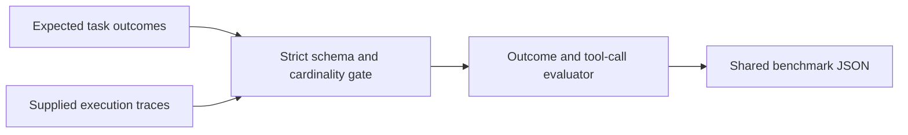

# #9 llm-agent-eval

**Benchmark:** `task_success_rate = 0.75`; tool-selection accuracy `0.75`; observed average latency `124.525 ms`; supplied trace cost `US$ 0.00072` across four tasks.

**Claim:** A local-first evaluation harness that validates and scores supplied agent execution traces against expected outcomes and expected tool calls. It does not implement or pretend to run an agent.

## What It Proves

The repository proves that recorded traces can be evaluated reproducibly without provider credentials. Strict input validation rejects malformed, duplicate, missing, or unknown task traces before metrics are emitted.

The committed fixture is deliberately mixed: one wrong outcome and one wrong tool selection prevent a perfect score by construction. Latency and cost are read from supplied trace telemetry; the evaluator never invents or estimates them.

## Input Contract

`data/fixtures/tasks.jsonl` defines one expected output and an ordered list of expected tool calls per task. `data/fixtures/traces.jsonl` supplies:

- `task_id` and observed `output`
- ordered `tool_calls[].name`
- observed non-negative `latency_ms`
- observed non-negative `cost_usd`

There must be exactly one trace for every task.

## Architecture



The evaluator depends only on files and standard-library types. Agent/provider execution remains outside this repository and can be replaced without changing the evaluation contract.

## Run Locally

```powershell
$env:PYTHONPATH = "src"
python -m llm_agent_eval benchmark --tasks data/fixtures/tasks.jsonl --traces data/fixtures/traces.jsonl --output benchmarks/results/agent-eval-baseline.json
```

## Run With Docker

```powershell
docker build -t llm-agent-eval .
docker run --rm llm-agent-eval
```

The result follows `.portfolio/contracts/benchmark-result.schema.json` and is committed at `benchmarks/results/agent-eval-baseline.json`.

## Scope

This benchmark evaluates supplied evidence. It does not demonstrate a live LLM, a planning graph, provider billing, or production-agent quality. Integrations should export the same trace contract and remain outside the scoring core.
