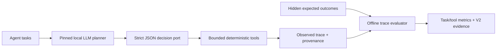

# #9 llm-agent-eval

**Benchmark:** a real local LLM agent completed `62.5%` of 8 tasks, selected the expected tool in `87.5%`, and recorded p95 latency of `3,006.96 ms` at `US$0.00` token tariff.

**Claim:** A local-first tool-routing graph that produces observed traces through a pinned model, executes bounded deterministic tools, and evaluates outcomes through a provider-neutral harness.

## What It Proves

The repository runs a three-node graph: `planner_model → tool_executor → trace_evaluator`. A pinned `qwen2.5-coder:0.5b` planner chooses one of `calculator`, `retriever`, or `formatter`; the tool node executes without shell access or `eval`; the evaluator then compares output and ordered tool calls with hidden expectations.

Five of eight tasks completed correctly. Seven selected the right tool. Two calculator arguments were malformed and one planner response was invalid, producing visible failures instead of fallback answers. This is measured agent behavior, not a hand-authored perfect trace.

## Benchmark Evidence

| Measure | Result |
|---|---:|
| Task success | `62.5%` |
| Tool-selection accuracy | `87.5%` |
| Tasks | `8` |
| Decision failures | `1` |
| Tool execution failures | `2` |
| Mean latency | `986.47 ms` |
| p95 latency | `3,006.96 ms` |
| Prompt / completion tokens | `583 / 139` |
| Local token tariff | `US$0.00` |

## Architecture


```mermaid
flowchart LR
  Input["Agent tasks"] --> Planner["Pinned local LLM planner"]
  Planner --> Port["Strict JSON decision port"]
  Port --> Tools["Bounded deterministic tools"]
  Tools --> Trace["Observed trace + provenance"]
  Expected["Hidden expected outcomes"] --> Eval["Offline trace evaluator"]
  Trace --> Eval
  Eval --> Evidence["Task/tool metrics + V2 evidence"]
```

The planner adapter and scoring core are separated by JSONL traces. Another OpenAI-compatible provider can replace Ollama without changing tools or evaluation policy.

## Run

Evaluate committed real traces offline:

```powershell
docker build -t llm-agent-eval .
docker run --rm --network none llm-agent-eval
```

Generate new traces through local Ollama by setting `AGENT_BASE_URL`, `AGENT_MODEL`, and the full `AGENT_MODEL_DIGEST`, then run `python -m llm_agent_eval run-agent`.

## Validate

```powershell
$env:PYTHONPATH = "src"
python -m unittest discover -s tests -v
./tools/validate-project.ps1
```

The raw result is `benchmarks/results/agent-eval-baseline.json`; provenance-bound V2 evidence is `benchmarks/publication/agent-eval-baseline-v2.json`.
