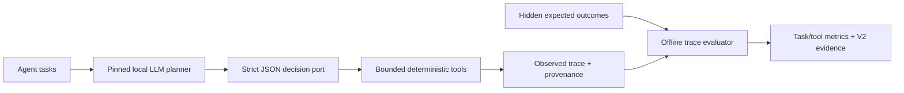

# LLM Agent Evaluation: Observed Traces from a Real Local Model, Failures Included

**A pinned local LLM agent completed `62.5%` of 8 tasks** and picked the expected tool in `87.5%` of them, with p95 latency of `3,006.96 ms` and zero token cost. The failures are measured behavior, kept visible instead of patched over with fallback answers.

[](https://github.com/Brilhante29/llm-agent-eval/actions/workflows/validate.yml)
[](LICENSE)


## Why this exists

Agent demos usually show one hand-picked transcript. Production questions are different: how often does the agent choose the right tool, what happens when it emits malformed arguments, and can a tool call ever reach a shell? This repository evaluates an agent the way a service is tested:

- a three-node graph, `planner_model -> tool_executor -> trace_evaluator`, with the model behind a strict JSON decision port;
- tools are bounded and deterministic (`calculator`, `retriever`, `formatter`), with no shell access and no `eval`;
- every run is recorded as a JSONL trace with model digest and provenance, then scored offline against hidden expectations;
- the scoring core is provider-neutral, so any OpenAI-compatible endpoint can replace Ollama.

## Results

| Measure | Result |
|---|---:|
| Task success | `62.5%` |
| Tool-selection accuracy | `87.5%` |
| Tasks | `8` |
| Decision failures | `1` |
| Tool execution failures | `2` |
| Mean latency | `986.47 ms` |
| p95 latency | `3,006.96 ms` |
| Prompt / completion tokens | `583 / 139` |
| Local token tariff | `US$0.00` |

Five of eight tasks completed correctly and seven selected the right tool. Two calculator calls carried malformed arguments and one planner response could not be turned into a valid decision; all three surface as failures in the trace. That is the signal a small `qwen2.5-coder:0.5b` planner should be expected to produce, and the reason the evaluator exists.

With eight samples, p95 is effectively the slowest call: the first task took 3,006.96 ms, about five times the others, which is consistent with model warm-up.

## Quickstart

Score the committed real traces offline:

```bash
docker build -t llm-agent-eval .
docker run --rm --network none llm-agent-eval
```

Generate new traces against a local Ollama model:

```bash
export AGENT_BASE_URL=http://localhost:11434/v1
export AGENT_MODEL=qwen2.5-coder:0.5b
export AGENT_MODEL_DIGEST=<full model digest from `ollama show`>
python -m llm_agent_eval run-agent
```

Tests:

```bash
PYTHONPATH=src python -m unittest discover -s tests -v
```

## How it works


```mermaid
flowchart LR
  Input["Agent tasks"] --> Planner["Pinned local LLM planner"]
  Planner --> Port["Strict JSON decision port"]
  Port --> Tools["Bounded deterministic tools"]
  Tools --> Trace["Observed trace + provenance"]
  Expected["Hidden expected outcomes"] --> Eval["Offline trace evaluator"]
  Trace --> Eval
  Eval --> Evidence["Task/tool metrics + V2 evidence"]
```

The planner adapter and the scoring core communicate only through JSONL traces, so generation (online, model-dependent) and evaluation (offline, deterministic) can run on different machines and at different times.

## Design decisions

| Decision | Why | Rejected |
|---|---|---|
| Functional core, imperative shell | Scoring is pure and testable; only the planner touches the network | Evaluation interleaved with model calls |
| Strict JSON decision port | Malformed output becomes a counted failure, not a guess | Lenient parsing with silent fallbacks |
| No shell, no `eval` in tools | An agent's tool surface is an attack surface | General-purpose code execution tools |
| Committed real traces | CI reproduces the score without a GPU or a model server | Re-running the model in CI |
| Local model pinned by digest | Same weights, same behavior, zero tariff | Floating model tags or paid APIs by default |

## Limitations

- Eight tasks: enough to exercise success and failure paths, not to rank models.
- One small local model; larger models would change the numbers, not the harness.
- Single-step tool routing; multi-step planning and memory are out of scope.

## Reproducibility

- Raw result: [`benchmarks/results/agent-eval-baseline.json`](benchmarks/results/agent-eval-baseline.json).
- Provenance-bound V2 evidence: [`benchmarks/publication/agent-eval-baseline-v2.json`](benchmarks/publication/agent-eval-baseline-v2.json).

## Project structure

```text
src/llm_agent_eval/   agent runner (planner, tools, traces) and CLI
tests/                planner port, tool safety, and scoring tests
data/fixtures/        tasks, hidden expectations, committed traces
benchmarks/           raw results and V2 publication evidence
sdd/  openspec/       specification, architecture and technical decisions
```

## How this repository is built

The project follows the spec-driven workflow of [portfolio-reuse-kit](https://github.com/Brilhante29/portfolio-reuse-kit). Requirements and decisions live in [`sdd/`](sdd) and [`openspec/`](openspec), and [`project.yaml`](project.yaml) records the architecture, stack, and rejected alternatives. Development is AI-assisted and human-governed: [`AGENTS.md`](AGENTS.md) and [`CLAUDE.md`](CLAUDE.md) hold the coding-agent instructions, while tests, validators, and CI decide what gets published.

## Related work

- [llm-eval-harness](https://github.com/Brilhante29/llm-eval-harness): contract-first scoring of RAG and LLM outputs.
- [prompt-ab-testing](https://github.com/Brilhante29/prompt-ab-testing): blinded, paired prompt experiments on the same local model family.
- [cost-aware-inference](https://github.com/Brilhante29/cost-aware-inference): latency and pricing assumptions for local versus hosted inference.

See [`REFERENCES.md`](REFERENCES.md) for attribution.

## Author

**Guilherme Brilhante**, software engineer working on scalable backends and production AI.
[LinkedIn](https://www.linkedin.com/in/guilhermefreirebrilhanteseveriano/) · [GitHub](https://github.com/Brilhante29) · [Publications](https://dblp.org/pid/353/6812.html)

## License

[MIT](LICENSE).
